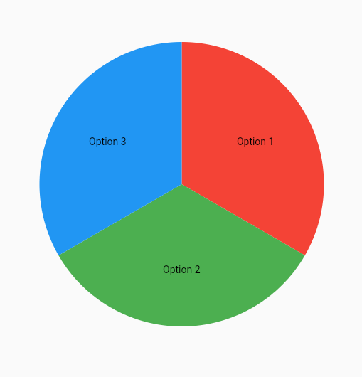

# WidgetSpinningWheel

A Flutter widget for spinning a wheel.

## Overview

The `WidgetSpinningWheel` is a customizable Flutter widget that allows you to create a spinning wheel interface. It can be used for various purposes such as games, decision-making tools, or random selection processes. The widget provides an interactive spinning experience and triggers a callback when the wheel comes to a stop.

## Features

- Spin the wheel by tapping on it or performing swipe gestures.
- Control the speed of the wheel spin.
- Customize the appearance of the wheel by providing labels and colors.
- Receive a callback with the selected label when the wheel stops spinning.



## Usage

To use the `WidgetSpinningWheel`, follow these steps:

1. Import the package:
   ```dart
   import 'package:your_package_name/widget_spinning_wheel.dart';
   ```

2. Create a `WidgetSpinningWheel` instance:
   ```dart
   WidgetSpinningWheel(
     labels: ['Option 1', 'Option 2', 'Option 3'],
     onSpinComplete: (String label) {
       // Handle the selected label
     },
     size: 200, // Specify the size of the spinning wheel
     defaultSpeed: 0.3, // Adjust the default spinning speed (optional)
     colours: [Colors.red, Colors.green, Colors.blue], // Customize colors (optional)
   )
   ```

3. Embed the `WidgetSpinningWheel` in your Flutter UI hierarchy.

## Example

Here's an example of using the `WidgetSpinningWheel` widget:

```dart
import 'package:flutter/material.dart';
import 'package:your_package_name/widget_spinning_wheel.dart';

void main() {
  runApp(MyApp());
}

class MyApp extends StatelessWidget {
  @override
  Widget build(BuildContext context) {
    return MaterialApp(
      home: Scaffold(
        appBar: AppBar(
          title: Text('Spinning Wheel Example'),
        ),
        body: Center(
          child: WidgetSpinningWheel(
            labels: ['Option 1', 'Option 2', 'Option 3'],
            onSpinComplete: (String label) {
              showDialog(
                context: context,
                builder: (BuildContext context) {
                  return AlertDialog(
                    title: Text('Selected Option'),
                    content: Text('You selected: $label'),
                    actions: [
                      TextButton(
                        onPressed: () {
                          Navigator.of(context).pop();
                        },
                        child: Text('OK'),
                      ),
                    ],
                  );
                },
              );
            },
            size: 200,
          ),
        ),
      ),
    );
  }
}
```

## Credits

This readme was generated with ChatGPT, an AI language model developed by OpenAI.

---
